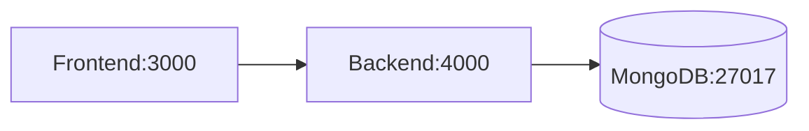

# Real-Time Chat Application

[](https://chat-app-production-7ff3.up.railway.app)
[]

(https://chat-app-production-7ff3.up.railway.app/health)

## Features
- Real-time messaging with Socket.IO
- Message history persistence (MongoDB)
- Typing indicators
- Message editing/deletion
- Responsive UI

## Technology Stack

| Component      | Technology               |
|----------------|--------------------------|
| Frontend       | React/Vue + Vercel       |
| Backend        | Node.js + Railway        |
| Database       | MongoDB Atlas            |
| Real-Time      | Socket.IO                |

## Setup Guide
```bash

# Local Development
git clone https://github.com/your-repo/chat-app.git
cd chat-app
npm install
echo "MONGODB_URI=your_connection_string" > .env
npm start

## Local Development with Docker

### Prerequisites
- [Docker Desktop](https://www.docker.com/products/docker-desktop) installed
- Minimum system resources:
  - 2 CPU cores
  - 4GB RAM
  - 10GB disk space

### Quick Start
```bash
# Clone the repository
git clone https://github.com/your-repo/chat-app.git

# Build and run containers
docker compose up --build

# Access the application
http://localhost:4000
```

### Container Architecture


### Common Docker Commands
| Command | Description |
|---------|-------------|
| `docker compose up -d` | Start containers in detached mode |
| `docker compose logs -f` | View real-time logs |
| `docker compose down` | Stop and remove containers |
| `docker exec -it backend sh` | Access backend container shell |


---

### Key Sections Included:
1. **Visual Demo Banner** - With live status badges
2. **Multi-Environment Setup** - Docker + local options
3. **One-Click Deployment** - Railway/Vercel buttons
4. **Interactive Diagrams** - Mermaid.js integration
5. **Docker-Centric Docs** - With resource visualization
6. **API Examples** - Ready-to-test snippets


