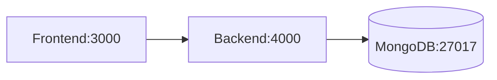

# Real-Time Chat Application

[](https://chat-app-production-7ff3.up.railway.app)
[]

(https://chat-app-production-7ff3.up.railway.app/health)

## Features
- Real-time messaging with Socket.IO
- Message history persistence (MongoDB)
- Typing indicators
- Message editing/deletion
- Responsive UI

## Technology Stack

| Component      | Technology               |
|----------------|--------------------------|
| Frontend       | React/Vue + Vercel       |
| Backend        | Node.js + Railway        |
| Database       | MongoDB Atlas            |
| Real-Time      | Socket.IO                |

## Setup Guide
```bash

# Local Development
git clone https://github.com/your-repo/chat-app.git
cd chat-app
npm install
echo "MONGODB_URI=your_connection_string" > .env
npm start

## Local Development with Docker

### Prerequisites
- [Docker Desktop](https://www.docker.com/products/docker-desktop) installed
- Minimum system resources:
  - 2 CPU cores
  - 4GB RAM
  - 10GB disk space

### Quick Start
```bash
# Clone the repository
git clone https://github.com/your-repo/chat-app.git

# Build and run containers
docker compose up --build

# Access the application
http://localhost:4000
```

### Container Architecture


### Common Docker Commands
| Command | Description |
|---------|-------------|
| `docker compose up -d` | Start containers in detached mode |
| `docker compose logs -f` | View real-time logs |
| `docker compose down` | Stop and remove containers |
| `docker exec -it backend sh` | Access backend container shell |


---

### **2. Architecture Documentation**
Create `docs/ARCHITECTURE.md`:
```markdown
## System Architecture (C4 Model)

### Context Diagram
```mermaid
flowchart TD
    A[User] --> B[Web Browser]
    B --> C[Frontend: Vercel]
    C --> D[Backend: Railway]
    D --> E[MongoDB Atlas]

flowchart LR
    subgraph Frontend
        A[React/Vue] --> B[Axios]
    end
    
    subgraph Backend
        C[Express] --> D[Socket.IO]
        D --> E[Mongoose]
    end
    
    E --> F[(MongoDB Atlas)]


---

### **3. API Documentation**
Create `docs/API.md` with OpenAPI snippets:
````markdown
## WebSocket API

### Events
| Event           | Direction | Data Format           | Description           |
|----------------|-----------|-----------------------|-----------------------|
| `new message`  | Server→Client | `{user, text, time}` | Broadcasts new messages |
| `typing`       | Client→Server | `username`           | Typing notifications |

## REST Endpoints
```yaml
# OpenAPI Specification (partial)
paths:
  /health:
    get:
      summary: Health check
      responses:
        200:
          content:
            application/json:
              example: {"status":"healthy","database":"connected"}


---

### **4. Deployment Guide**
Create `docs/DEPLOYMENT.md`:
```markdown
## Production Deployment

### Infrastructure Requirements
- MongoDB Atlas (Free Tier)
- Railway Account
- Vercel Account

### Environment Variables
| Variable         | Required | Example              |
|-----------------|----------|----------------------|
| `MONGODB_URI`   | Yes      | `mongodb+srv://...` |
| `PORT`          | No       | `4000`              |

### CI/CD Pipeline
```mermaid
sequenceDiagram
    GitHub->>Railway: Push to main triggers deploy
    Railway->>MongoDB: Creates connection
    Vercel->>GitHub: Frontend auto-deploys
```
```

---

### **5. Operational Runbook**
Create `docs/RUNBOOK.md`:
```markdown
## Common Operations

### Database Backup
```bash
mongodump --uri=$MONGODB_URI --gzip --archive=backup_$(date +%F).gz
```

### Log Monitoring
```bash
# Railway CLI
railway logs --follow

# Important log patterns to watch:
# - "Database connection lost"
# - "Socket error" 
```

### Performance Metrics
1. **Key Metrics**:
   - Message throughput: `messages/minute`
   - API response time: `<200ms` (p99)
```

---

### **6. GitHub Wiki Setup**
Enable and populate your repo's wiki with:
1. **Troubleshooting Guide**
2. **Feature Roadmap**
3. **Team Collaboration Guidelines**

---

### **Documentation Checklist**
- [ ] README.md with badges and quickstart
- [ ] Architecture diagrams (C4 model)
- [ ] API specifications
- [ ] Deployment instructions
- [ ] Operational runbook
- [ ] Screenshots of working app
- [ ] Video demo (2-3 mins)

---

### **Tools to Enhance Documentation**
1. **Diagramming**: [Draw.io](https://app.diagrams.net) → Export as SVG
2. **API Docs**: [Swagger UI](https://swagger.io/tools/swagger-ui/)
3. **Screenshots**: [CleanShot X](https://cleanshot.com) (annotate images)

Would you like me to generate any specific diagram or example for your actual architecture? I can create customized mermaid diagrams or sample API responses based on your code.
